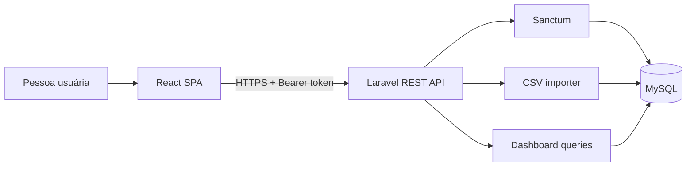

# GreenMeter Lite

MVP full stack para importar leituras de energia, acompanhar consumo e estimar emissões associadas. O projeto demonstra uma API REST autenticada, ingestão segura de CSV, isolamento de dados por usuário, visualização de séries temporais e uma regra simples para destacar picos semanais.

> Projeto de portfólio com dados demonstrativos. As estimativas não substituem um inventário de emissões certificado.

## O que o produto entrega

- Login com tokens Laravel Sanctum, limite de tentativas e revogação no logout.
- Importação atômica de CSV com cabeçalho, tipo, tamanho, quantidade de linhas e valores validados.
- KPIs de energia total, CO₂e estimado e média diária.
- Série diária de consumo e alertas quando um dia supera em 30% a média da própria semana.
- Separação das leituras por usuário autenticado.
- Interface responsiva e acessível em português.
- Testes automatizados no backend e no frontend, executados no GitHub Actions.
- Ambiente reproduzível com Docker Compose.

## Stack

| Camada | Tecnologias |
| --- | --- |
| Frontend | React 19, TypeScript, Vite, TanStack Query, Chart.js, Axios |
| Backend | PHP 8.3, Laravel 13, Sanctum, Pest |
| Dados | MySQL 8.4 em desenvolvimento; SQLite em memória nos testes |
| Qualidade | Vitest, Testing Library, Laravel Pint, GitHub Actions |
| Infra local | Docker e Docker Compose |
| Deploy | Railway, FrankenPHP/Caddy e Nginx |

## Arquitetura



A descrição das decisões e dos limites do MVP está em [docs/architecture.md](docs/architecture.md).

## Executar com Docker

Pré-requisitos: Docker Desktop e Docker Compose.

```bash
cp .env.example .env
```

Defina valores locais fortes para `DB_PASSWORD` e `DB_ROOT_PASSWORD`. Em seguida:

```bash
docker compose build
docker run --rm greenmeter-lite-backend php artisan key:generate --show
```

Copie o valor exibido para `APP_KEY` no arquivo `.env`. Para criar uma conta local de demonstração, preencha também `DEMO_ADMIN_EMAIL` e `DEMO_ADMIN_PASSWORD`. Depois execute:

```bash
docker compose up
```

- Frontend: `http://localhost:5173`
- API: `http://localhost:8000`
- Health check: `http://localhost:8000/up`

Nenhuma credencial pública é criada por padrão.

## Executar sem Docker

### Backend

```bash
cd backend
cp .env.example .env
composer install
php artisan key:generate
php artisan migrate --seed
php artisan serve
```

Configure o MySQL no `backend/.env`. A conta demo é opcional e depende das variáveis `DEMO_ADMIN_EMAIL` e `DEMO_ADMIN_PASSWORD`.

### Frontend

Requer Node.js 22.22.2 ou superior.

```bash
cd frontend
cp .env.example .env
npm ci
npm run dev
```

## Formato do CSV

```csv
timestamp,metric,value,unit
2026-01-01T00:00:00Z,energy,12.5,kWh
```

Regras do MVP:

- arquivo CSV/TXT de até 2 MB;
- no máximo 10.000 leituras por importação;
- `metric` deve ser `energy` e `unit` deve ser `kWh`;
- `value` deve ser numérico e não negativo;
- uma linha inválida cancela toda a importação.

Um arquivo válido está disponível em [`samples/energy_readings.csv`](samples/energy_readings.csv).

## API

| Método | Rota | Proteção | Função |
| --- | --- | --- | --- |
| `POST` | `/api/auth/login` | Pública + rate limit | Autentica e emite token |
| `GET` | `/api/auth/user` | Sanctum | Retorna a pessoa autenticada |
| `POST` | `/api/auth/logout` | Sanctum | Revoga o token atual |
| `POST` | `/api/readings/upload` | Sanctum | Valida e importa CSV |
| `GET` | `/api/dashboard/kpis` | Sanctum | Retorna KPIs por período |
| `GET` | `/api/dashboard/series` | Sanctum | Retorna série diária |
| `GET` | `/api/alerts` | Sanctum | Retorna picos semanais |

Os endpoints de consulta aceitam `from` e `to` no formato `YYYY-MM-DD`.

## Qualidade

```bash
# Backend
cd backend && composer check

# Frontend
cd frontend && npm run check
```

O workflow em `.github/workflows/ci.yml` executa lint, testes, typecheck e build em todo push para `main` e em pull requests.

## Segurança e privacidade

- O token fica apenas em memória no frontend; não é persistido em `localStorage`.
- Uploads têm limites e validação antes da transação no banco.
- As consultas sempre filtram pelo usuário autenticado.
- Segredos e arquivos `.env` são ignorados pelo Git.
- Credenciais de demonstração não são publicadas no repositório.
- Vulnerabilidades devem ser reportadas conforme [SECURITY.md](SECURITY.md).

## Deploy

O projeto possui configuração para frontend, API e MySQL na Railway. A topologia, as variáveis e a ordem de provisionamento estão documentadas em [`docs/deployment.md`](docs/deployment.md). Segredos nunca são versionados.

## Limites atuais e próximos passos

- Não há cadastro ou recuperação de senha; contas são provisionadas pelo ambiente no MVP.
- O fator de emissão é demonstrativo e precisa de fonte/versionamento antes de uso real.
- A detecção de pico é uma heurística, não um modelo estatístico.
- O endereço público será incluído após a validação do primeiro deploy.
- Próximas evoluções: OpenAPI, paginação/histórico de importações, observabilidade e testes end-to-end.

## Material de entrevista

As decisões, trade-offs e perguntas prováveis estão resumidos em [`INTERVIEW_GUIDE.md`](INTERVIEW_GUIDE.md).
