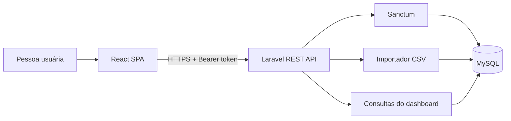

# GreenMeter Lite

Aplicação full stack para importar leituras de energia, acompanhar consumo e estimar emissões associadas. O projeto demonstra cadastro e autenticação, uma API REST, ingestão segura de CSV, isolamento por usuário, auditoria de importações e visualizações acessíveis.

> Projeto de portfólio com dados demonstrativos. As estimativas não substituem um inventário de emissões certificado.

## Demo publicada

- Aplicação: [GreenMeter Lite na Railway](https://strong-luck-production-00b9.up.railway.app)
- API: [health check do backend](https://greenmeter-lite-production.up.railway.app/up)

Na tela de login, **Explorar demonstração** abre uma conta somente leitura com dados fictícios. Nenhuma senha de demonstração é exposta.

## Principais recursos

- Cadastro com validação, senha armazenada com hash e autenticação automática.
- Login e logout com Laravel Sanctum e limite de tentativas.
- Demonstração em um clique, identificada visualmente e bloqueada para escrita.
- Importação atômica de CSV com validações de formato, tamanho, linhas e valores.
- Histórico auditável de importações por usuário.
- KPIs, série diária, filtros por período e picos comparados à média semanal.
- Alternância entre gráfico e tabela para uma leitura acessível.
- Especificação OpenAPI, health checks e `X-Request-ID` para rastreabilidade.
- Testes automatizados e integração contínua.

## Stack

| Camada | Tecnologias |
| --- | --- |
| Frontend | React 19, TypeScript, Vite, TanStack Query, Chart.js, Axios |
| Backend | PHP 8.3, Laravel 13, Sanctum, Pest |
| Dados | MySQL 8.4; SQLite em memória nos testes |
| Qualidade | Vitest, Testing Library, Laravel Pint, GitHub Actions |
| Infra | Docker Compose, Railway, FrankenPHP/Caddy e Nginx |

## Arquitetura



Veja [arquitetura](docs/architecture.md), [modelo de ameaças](docs/threat-model.md) e [ADRs](docs/adr/).

## Executar com Docker

Pré-requisitos: Docker Desktop e Docker Compose.

```bash
cp .env.example .env
docker compose build
docker run --rm greenmeter-lite-backend php artisan key:generate --show
```

Copie a chave exibida para `APP_KEY` em `.env`, defina senhas locais fortes para o banco e execute:

```bash
docker compose up
```

- Frontend: `http://localhost:5173`
- API: `http://localhost:8000`
- Health check: `http://localhost:8000/up`
- Readiness: `http://localhost:8000/api/health/readiness`
- OpenAPI: `http://localhost:8000/api/docs`

## Executar sem Docker

### Backend

```bash
cd backend
cp .env.example .env
composer install
php artisan key:generate
php artisan migrate --seed
php artisan serve
```

### Frontend

Requer Node.js 22.22.2 ou superior.

```bash
cd frontend
cp .env.example .env
npm ci
npm run dev
```

## Formato do CSV

```csv
timestamp,metric,value,unit
2026-01-01T00:00:00Z,energy,12.5,kWh
```

O arquivo deve ter até 2 MB e 10.000 leituras. `metric` deve ser `energy`, `unit` deve ser `kWh`, e `value` deve ser numérico e não negativo. Uma linha inválida cancela toda a operação. Baixe um exemplo em [`samples/energy_readings.csv`](samples/energy_readings.csv) ou pela própria interface.

## API

| Método | Rota | Proteção | Função |
| --- | --- | --- | --- |
| `POST` | `/api/auth/register` | Pública + rate limit | Cria a conta e emite token |
| `POST` | `/api/auth/login` | Pública + rate limit | Autentica e emite token |
| `POST` | `/api/auth/demo` | Pública + rate limit | Inicia sessão demo somente leitura |
| `GET` | `/api/auth/user` | Sanctum | Retorna a pessoa autenticada |
| `POST` | `/api/auth/logout` | Sanctum | Revoga o token atual |
| `POST` | `/api/readings/upload` | Sanctum + bloqueio demo | Valida e importa CSV |
| `GET` | `/api/imports` | Sanctum | Lista o histórico de importações |
| `GET` | `/api/dashboard/kpis` | Sanctum | Retorna KPIs por período |
| `GET` | `/api/dashboard/series` | Sanctum | Retorna a série diária |
| `GET` | `/api/alerts` | Sanctum | Retorna picos semanais |

Os endpoints de consulta aceitam `from` e `to` em `YYYY-MM-DD`. A especificação completa está em [`docs/openapi.yaml`](docs/openapi.yaml).

## Qualidade

```bash
cd backend && composer check
cd frontend && npm run check
```

O CI executa lint, testes, typecheck e build em pushes para `main` e em pull requests.

## Segurança e privacidade

- Tokens ficam somente em memória no frontend.
- Senhas nunca são armazenadas em texto puro.
- Cadastro ignora qualquer tentativa de definir privilégios ou `is_demo`.
- A conta demo é criada pelo seeder com senha aleatória e só recebe token pela rota controlada.
- Consultas e importações são isoladas pelo `user_id` autenticado.
- Segredos e arquivos `.env` não são versionados.
- Consulte [SECURITY.md](SECURITY.md) para reportar vulnerabilidades.

## Limites e próximos passos

- Não há recuperação ou verificação de e-mail na versão 1.0.
- O fator de emissão é demonstrativo e precisa de fonte e versionamento para uso real.
- A detecção de picos é uma heurística explicável, não um modelo estatístico.
- O bundle do frontend deve receber divisão por rota em uma evolução de desempenho.
- O próximo passo recomendado é adicionar testes end-to-end do cadastro ao dashboard.

## Material de entrevista

As decisões e trade-offs estão resumidos em [`INTERVIEW_GUIDE.md`](INTERVIEW_GUIDE.md).
